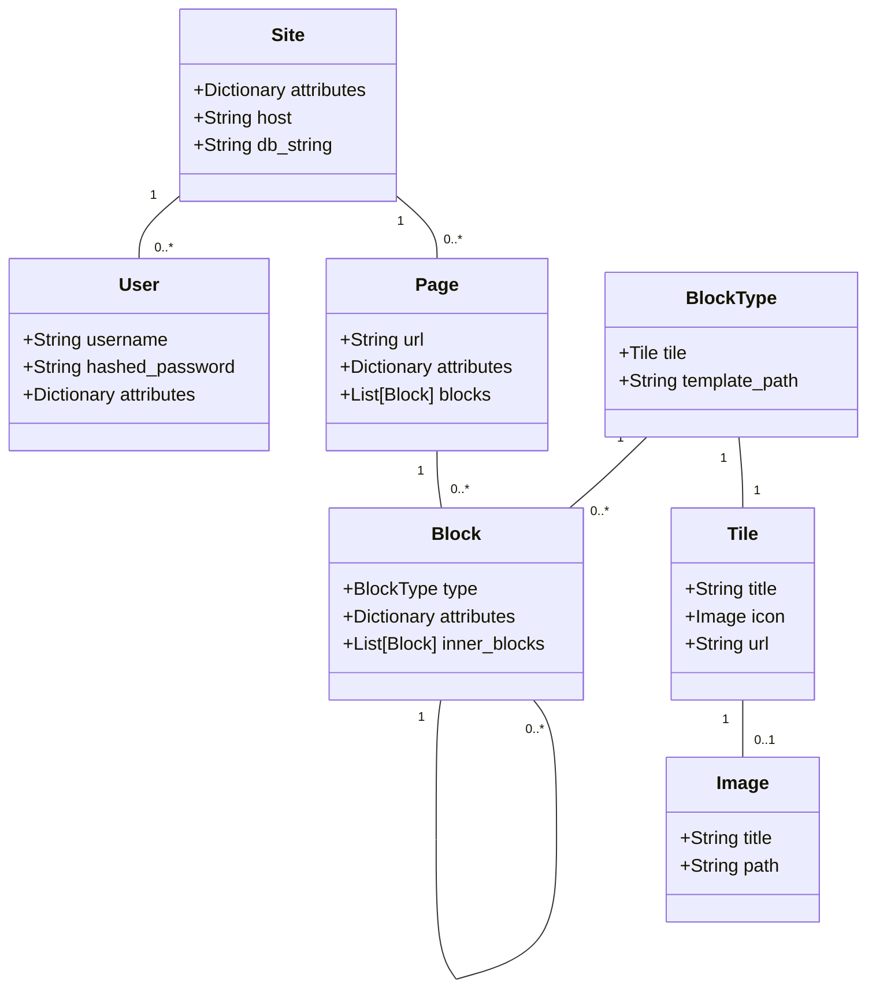

```mermaid
classDiagram


    class User {
    +String username
    +String hashed_password
    +Dictionary attributes
    }

    class Site {
    +Dictionary attributes
    +String host
    +String db_string
    }
    Site "1" -- "0..*" User
    Site "1" -- "0..*" Page

    class Page {
        +String url
        +Dictionary attributes
        +List[Block] blocks
    }
    Page "1" -- "0..*" Block

    class BlockType {
        +Tile tile
        +String template_path
    }    
    class Block {
        +BlockType type
        +Dictionary attributes
        +List[Block] inner_blocks
    }
    BlockType "1" -- "0..*" Block
    Block "1" -- "0..*" Block
    BlockType "1" -- "1" Tile

    class Image {
        +String title
        +String path
    }
    class Tile {
        +String title
        +Image icon
        +String url
    }
    Tile "1" -- "0..1" Image

```